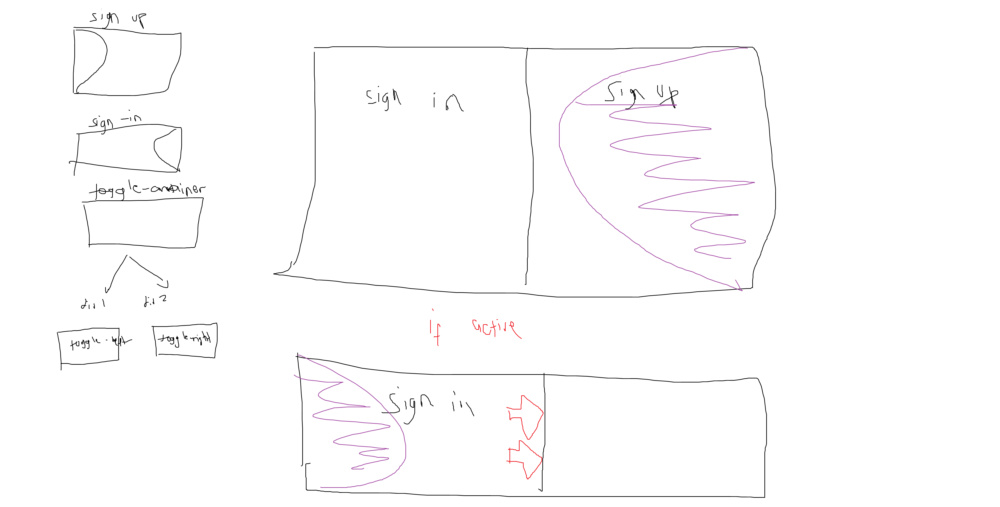
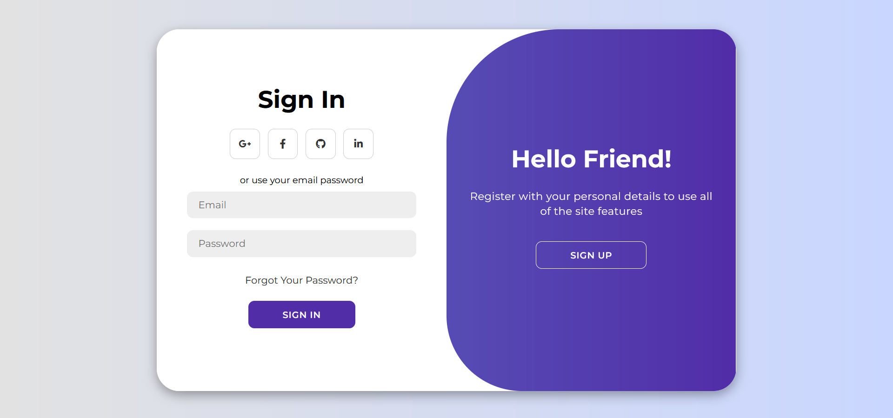

# Modern Animated Login Page
This is as mini-project that I made using the combination of the Front-End Trio. Fnished and Morning of 9 and finished the night of the same day.

## Core Learnings
- The time you re-create this mini-project start with adding and styling the two necessary elements
<code>Sign In | Sign Up</code> then do the animation and positioning used.

## Core things that haven't fully comprehended yet
- Identify the things you can do with <code>transform: translateX(100%)</code> play around with this property.
- Go back to the back of the code where you start coding for the <code>div.toggle-contianer</code> and the rest.
- Do note that the necessary JavaScript codes are yet to be added.

## Template and Preview

